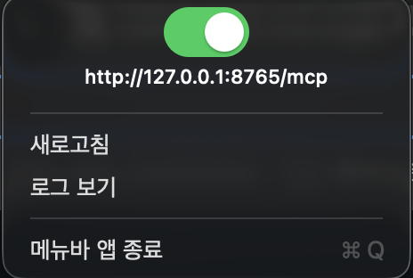

# mem0-mcp-toggle

A local **[Mem0](https://github.com/mem0ai/mem0) MCP server** for macOS that you can flip **on/off from a menu bar switch** (or the CLI). Memories are stored locally in **Chroma**, and fact extraction runs against any **OpenAI-compatible LLM** (e.g. local **LM Studio**).

> Unofficial community tool — not affiliated with mem0ai.

<p align="center">
  
  <br>
  <sub>Menu bar toggle — flip it on and the live server URL appears.</sub>
</p>

It runs the MCP server as a **single HTTP server** managed by `launchd`, so multiple MCP clients (Kiro, Claude Desktop, Cursor, …) share **one** process — no per-client duplicate/zombie processes. Turn it off when you don't need it to free RAM (~200 MB).

```
 menu bar  ┌──────────────┐     HTTP      ┌──────────────────────┐
 toggle ──▶│  launchd      │──────────────▶│ mem0 MCP server      │
 (NSSwitch)│  com.mem0mcp  │  127.0.0.1    │ Chroma + OpenAI LLM  │
           └──────────────┘   :8765/mcp    └──────────────────────┘
                                                    │
 MCP clients (Kiro/Claude/Cursor) ─────────────────┘  (connect by URL)
```

## Prerequisites

- **macOS 12+**
- **Xcode Command Line Tools** (for `swiftc`): `xcode-select --install`
- **Python 3.10+** (`python3`)
- **An OpenAI-compatible LLM endpoint.** Default targets **LM Studio** at `http://localhost:1234/v1`.
  - ⚠️ **Use a NON-reasoning *instruct* model** (e.g. `Qwen2.5-14B-Instruct`, `Qwen2.5-7B-Instruct`, `Llama-3.1-8B-Instruct`). Reasoning models (Qwen3 / QwQ / R1 …) put output in a separate channel and **break** mem0's extraction.

## What `install.sh` does (and what you provide)

**`install.sh` handles all software automatically** — you do **not** need to pre-install mem0 or any Python package. It creates an **isolated virtualenv** (`./.venv`) and installs everything from `requirements.txt` there (mem0ai, fastmcp, chromadb, sentence-transformers). Any system/global mem0 is irrelevant and left untouched.

- The embedding model (`all-MiniLM-L6-v2`) is **downloaded automatically on the first memory write** (needs internet once, then it's cached locally).

**You provide (once):**
1. macOS + Xcode CLT + Python 3.10+ (see Prerequisites above).
2. A running **LLM endpoint** (see below) — the only required external service.
3. One line in your MCP client config (see "Connect your MCP client").

### Using a cloud LLM instead of LM Studio
The default targets local LM Studio, but any OpenAI-compatible API works — pass overrides at install time:

```bash
MEM0_LLM_BASE_URL=https://api.openai.com/v1 \
MEM0_LLM_API_KEY=sk-... \
MEM0_LLM_MODEL=gpt-4o-mini \
MEM0_DISABLE_JSON_RESPONSE_FORMAT=0 \
./install.sh
```

Set `MEM0_DISABLE_JSON_RESPONSE_FORMAT=0` when your endpoint supports `{"type":"json_object"}` (e.g. OpenAI); keep `1` for LM Studio.

## Install

```bash
git clone <this-repo> mem0-mcp-toggle
cd mem0-mcp-toggle
./install.sh
```

Override defaults with env vars:

```bash
MEM0_LLM_MODEL=qwen2.5-7b-instruct \
MEM0_LLM_BASE_URL=http://localhost:1234/v1 \
MEM0_MCP_PORT=8765 \
./install.sh
```

`install.sh` creates a Python venv, installs deps, builds the menu bar app to `~/Applications/mem0 toggle.app`, and installs two `launchd` agents:

| Label | Role | Start policy |
|-------|------|--------------|
| `com.mem0mcp.server` | the mem0 HTTP MCP server | **manual** (starts OFF; toggle it on) |
| `com.mem0mcp.toggle` | the menu bar switch app | starts at login |

## Connect your MCP client

Add to your client's MCP config (e.g. `~/.kiro/settings/mcp.json`, Claude Desktop, Cursor):

```json
{
  "mcpServers": {
    "local-mem0-mcp": {
      "url": "http://127.0.0.1:8765/mcp",
      "type": "http",
      "timeout": 300000
    }
  }
}
```

Tools exposed: `add_memory`, `search_memories`, `list_memories`, `delete_memory`.

## Usage

Memory works **only when both are true: (1) the server is ON, and (2) your LLM endpoint is running.** Here's the actual flow:

### One-time, after install
1. **Start your LLM endpoint.** In LM Studio: load a *non-reasoning instruct* model → open the **Local Server** tab → **Start Server** (port `1234`). (Or point `MEM0_LLM_BASE_URL` at a cloud endpoint.)
2. **Register the MCP server** in your client config once (see [Connect your MCP client](#connect-your-mcp-client)).

### Each time you want to use memory
1. **Turn the server ON** — click the `memorychip` icon in the menu bar and flip the switch. The icon brightens and the row shows the server URL (`http://127.0.0.1:8765/mcp`).
   - CLI equivalent: `mem0 on`
2. **Just talk to your AI client** — it calls the tools automatically. For example:
   - *"Remember that we deploy via GitHub Actions."* → `add_memory`
   - *"What do you know about our deployment?"* → `search_memories`
   - *"List everything you remember."* → `list_memories`
3. **Turn it OFF when done** to free ~200 MB — flip the switch off, or `mem0 off`.

**Check status anytime:** run `mem0` (prints `ON`/`OFF`), or glance at the menu bar icon (dim = OFF).

### CLI control (no GUI)
```bash
launchctl kickstart gui/$(id -u)/com.mem0mcp.server   # ON
launchctl kill TERM gui/$(id -u)/com.mem0mcp.server   # OFF
```
Optional `mem0` helper — add to `~/.zshrc`:
```bash
mem0(){ local D="gui/$(id -u)/com.mem0mcp.server";
  case "$1" in on) launchctl kickstart "$D";; off) launchctl kill TERM "$D";;
  *) lsof -nP -iTCP:8765 -sTCP:LISTEN >/dev/null && echo ON || echo OFF;; esac; }
```

## Configuration (server env vars)

Set these in `launchd/com.mem0mcp.server.plist.template` (then re-run install) or pass to `install.sh`:

| Var | Default | Notes |
|-----|---------|-------|
| `MEM0_LLM_MODEL` | `qwen2.5-14b-instruct` | non-reasoning instruct model |
| `MEM0_LLM_BASE_URL` | `http://localhost:1234/v1` | OpenAI-compatible endpoint |
| `MEM0_LLM_API_KEY` | `lm-studio` | any non-empty string for LM Studio |
| `MEM0_EMBEDDER_MODEL` | `sentence-transformers/all-MiniLM-L6-v2` | local embeddings |
| `MEM0_CHROMA_PATH` | `~/.mem0-mcp/chroma` | vector store location |
| `MEM0_MCP_PORT` | `8765` | HTTP port (also update the app constant + mcp.json if changed) |
| `MEM0_DISABLE_JSON_RESPONSE_FORMAT` | `1` | workaround for LM Studio rejecting `json_object` (HTTP 400) |

## Why this design

**In mem0 terms, this is the official OSS quickstart pattern — run 100% locally and wrapped as MCP.** The [Python SDK quickstart](https://docs.mem0.ai/open-source/python-quickstart) initializes `Memory.from_config(...)` and calls `m.add()` / `m.search()` — exactly what this server does. We only swap every default to a local component and expose it over MCP:

| Component | mem0 quickstart default | This project |
|-----------|-------------------------|--------------|
| LLM | OpenAI `gpt-5-mini` (cloud API key) | local **LM Studio** — `qwen2.5-14b-instruct`, OpenAI-compatible |
| Embedder | OpenAI `text-embedding-3-small` (1536d) | local **HuggingFace** `all-MiniLM-L6-v2` (384d) |
| Vector store | Qdrant (`/tmp/qdrant`) | **Chroma** (`~/.mem0-mcp/chroma`) |
| Interface | Python `m.add()` / `m.search()` | **MCP tools** over HTTP (via FastMCP) |

So the memory/search behavior is stock mem0 — nothing custom there. Everything else is just local-first packaging (no cloud, no API key, data stays on your Mac) plus the menu bar toggle. The specific choices below come from real debugging — they're not arbitrary:

- **One HTTP server via `launchd` (not stdio).** MCP stdio spawns a *separate* server process **per client**. With multiple clients (e.g. an IDE **and** a CLI) reading the same config you get duplicate servers, and they orphan into **zombie processes** when a client crashes/quits (macOS reparents them to `launchd`). A single shared HTTP server removes duplication and keeps a **single Chroma writer**.
- **Manual on/off (starts OFF).** The server holds ~200 MB (embedder + runtime). A `launchd`-managed single instance you toggle on demand frees that RAM when idle — with **no zombies** (one managed instance, not per-client spawns).
- **A NON-reasoning *instruct* model is required.** mem0 reads the LLM's `content`. Reasoning models (Qwen3 / QwQ / R1 …) spend their output budget in a separate reasoning channel, leaving `content` **empty** (and they're slow), so mem0 extracts **nothing**. Instruct models return the JSON in `content`.
- **`response_format=None` workaround.** mem0 asks the LLM for `{"type":"json_object"}`, which LM Studio rejects with HTTP 400 (`must be 'json_schema' or 'text'`). We disable it; a good instruct model still returns valid JSON from the prompt.
- **Long MCP `timeout` (300 s).** mem0's extraction prompt is large; a single long memory can take ~80 s on a 14B model. Default client timeouts (~60 s) would cut the request off before it persists.

## Troubleshooting

- **`add_memory` says success but nothing is stored** → almost always the LLM. Use a **non-reasoning instruct** model, and make sure the LLM endpoint is actually running.
- **Long memories don't save / time out** → big inputs make mem0's extraction slow (~80 s on a 14B). The MCP `timeout: 300000` covers it; for speed use a 7–8B model or store shorter facts.
- **HTTP 400 `'response_format.type' must be 'json_schema' or 'text'`** → LM Studio doesn't accept `json_object`; keep `MEM0_DISABLE_JSON_RESPONSE_FORMAT=1` (default).
- **Icon not in menu bar** → `launchctl kickstart gui/$(id -u)/com.mem0mcp.toggle`, or `open "$HOME/Applications/mem0 toggle.app"`.
- **Only runs while logged in** — these are LaunchAgents (per-user GUI session), not boot daemons.
- **Logs:** `~/Library/Logs/mem0-mcp.log`, `~/Library/Logs/mem0-toggle.log`.

## Uninstall

```bash
./uninstall.sh
```
Removes the agents + app, keeps your stored memories (`~/.mem0-mcp/chroma`) and venv.

## License

MIT — see [LICENSE](LICENSE). Built on [mem0ai/mem0](https://github.com/mem0ai/mem0), [FastMCP](https://github.com/jlowin/fastmcp), [Chroma](https://github.com/chroma-core/chroma), and [sentence-transformers](https://github.com/UKPLab/sentence-transformers); each retains its own license.
